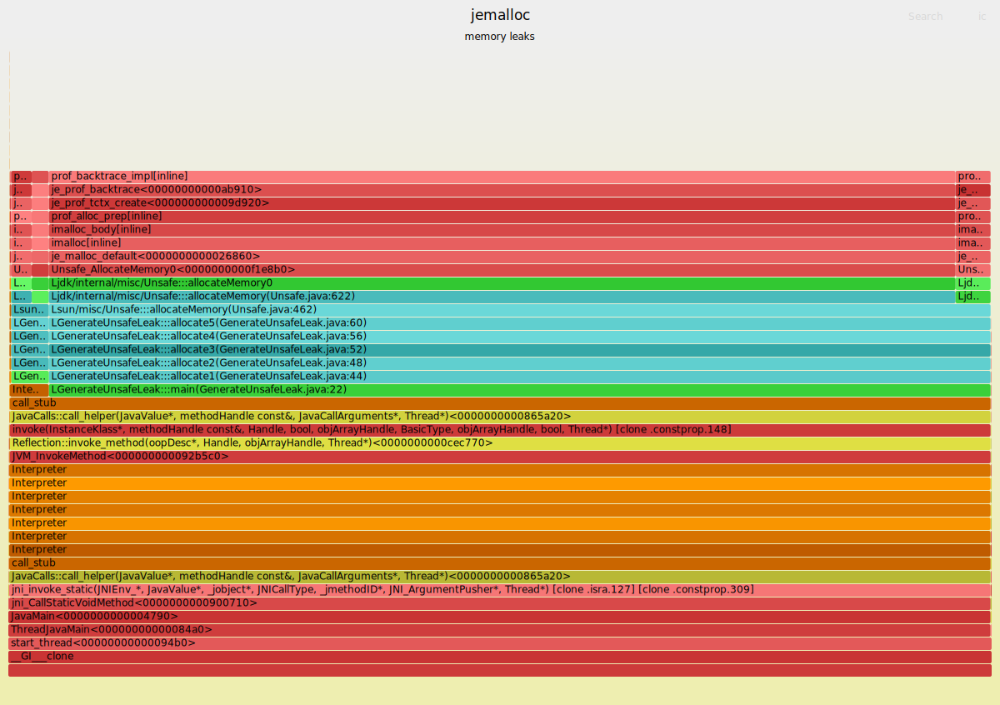

# JVM and JEMALLOC Flamegraphs

### How to generate a flamegraph

#### Start a leaking program

```
# you can add `-XX:-Inline` to disable inlining 

MALLOC_CONF=prof_leak:true,lg_prof_sample:0,prof_prefix:/tmp/jeprof,prof_final:true java -XX:+UnlockDiagnosticVMOptions -XX:+DebugNonSafepoints -XX:+PreserveFramePointer -XX:+UseSerialGC examples/GenerateUnsafeLeak.java
```

##### Why we need -XX:+PreserveFramePointer ?

- https://www.nongnu.org/libunwind/man/libunwind-dynamic(3).html

```
For libunwind to do its job, it needs to be able to reconstruct the frame state of each frame in a call-chain. 
The frame state describes the subset of the machine-state that consists of the frame registers (typically the 
instruction-pointer and the stack-pointer) and all callee-saved registers (preserved registers). The frame 
state describes each register either by providing its current value (for frame registers) or by providing 
the location at which the current value is stored (callee-saved registers).
```

#### Create a PERF_FILE (symbols)

```
create-java-perf-map.sh `pgrep -f GenerateUnsafe`
```

#### Generate a flamegraph

```
# profiles and symbols are taken from /tmp, and `flames.svg` is generated into a current folder
# `latest` parameter means the very latest PERF_FILE and jeprof heap files in /tmp folder 

java -jar jjf.jar --latest
```



-  C code
-  Java code
-  Inlined Java code
-  JVM code
-  JVM generated code (Interpreter, stubs, ...)

### jemalloc

#### Technical details of Heap Profiling and Leak Checker inspired by tcmalloc
- `git clone https://github.com/gperftools/gperftools`
- open `/docs/index.html`

#### Resources

- https://github.com/jemalloc/jemalloc
- https://github.com/jeffgriffith/native-jvm-leaks/
- https://www.youtube.com/watch?v=gWSXbqxnJfs
- https://technology.blog.gov.uk/2015/12/11/using-jemalloc-to-get-to-the-bottom-of-a-memory-leak/
- https://www.evanjones.ca/java-native-leak-bug.html
- JVM Explanation: https://www.elastic.co/blog/tracking-down-native-memory-leaks-in-elasticsearch

- https://github.com/jemalloc/jemalloc/issues/356

- Heap Profiling: https://github.com/jemalloc/jemalloc/wiki/Use-Case%3A-Heap-Profiling
- Leak Checking: https://github.com/jemalloc/jemalloc/wiki/Use-Case:-Leak-Checking

#### Pitfalls

- Why do I see 100% in je_prof_backtrace - https://github.com/jemalloc/jemalloc/issues/507

```
heap profiling gives you the full stack trace when the sample is taken. 
That means prof_backtrace (which invokes stack unwinding and gets the trace) 
is almost always the top element on the stack, assuming it's not inlined. 
To utilize the stack trace from profiling, you will need to look further onto 
the stack. For example, a trace may look like:

... ==> some_function_in_application ==> je_malloc ==> je_prof_backtrace

in which case you may want to focus on the functions in the application 
instead of allocator. Similarly, it's also common to see operator new or 
equivalent in the runtime.
```

#### How to start it up

#### Install Jemalloc

- automatically installs `jeprof` tool

```
$ git clone https://github.com/jemalloc/jemalloc.git
$ ./autogen.sh --enable-prof --disable-prof-libgcc --disable-prof-gcc --enable-prof-libunwind
$ make 
$ sudo make install

$ whereis jeprof
jeprof: /usr/local/bin/jeprof
```

#### Install PERF_MAP_AGENT

- creates a tool `./bin/create-java-perf-map.sh`

```
$ git clone https://github.com/jvm-profiling-tools/perf-map-agent.git
$ cmake .
$ make
```

- export it to the environment using a property

```
$ export PERF_MAP_HOME=<path-to-repo>/perf-map-agent
```

#### Verify the installation of Jemalloc

```
# Verify 
MALLOC_CONF=stats_print:true java -version

openjdk version "16.0.1" 2021-04-20
OpenJDK Runtime Environment (build 16.0.1+9-Ubuntu-120.04)
OpenJDK 64-Bit Server VM (build 16.0.1+9-Ubuntu-120.04, mixed mode, sharing)
___ Begin jemalloc statistics ___
Version: "5.2.1-0-gea6b3e973b477b8061e0076bb257dbd7f3faa756"
Build-time option settings
  config.cache_oblivious: true
  config.debug: false
  config.fill: true
  config.lazy_lock: false
  config.malloc_conf: ""
  config.opt_safety_checks: false
  config.prof: false
  config.prof_libgcc: false
  config.prof_libunwind: false
  config.stats: true
  config.utrace: false
  config.xmalloc: false
Run-time option settings
  opt.abort: false
  opt.abort_conf: false
  opt.confirm_conf: false
  opt.retain: true
  opt.dss: "secondary"
  opt.narenas: 32
  opt.percpu_arena: "disabled"
  opt.oversize_threshold: 8388608
  opt.metadata_thp: "disabled"
  opt.background_thread: false (background_thread: false)
  opt.dirty_decay_ms: 10000 (arenas.dirty_decay_ms: 10000)
  opt.muzzy_decay_ms: 0 (arenas.muzzy_decay_ms: 0)
  opt.lg_extent_max_active_fit: 6
  opt.junk: "false"
  opt.zero: false
  opt.tcache: true
  opt.lg_tcache_max: 15
  opt.thp: "default"
  opt.stats_print: true
  opt.stats_print_opts: ""
```

Profiling:
```
git clone https://github.com/jemalloc/jemalloc.git
./autogen.sh --enable-prof --disable-prof-libgcc --disable-prof-gcc --enable-prof-libunwind
make 
sudo make install
```

- `git clone https://github.com/jemalloc/jemalloc.git`
- `./autogen.sh --enable-prof --disable-prof-libgcc --disable-prof-gcc --enable-prof-libunwind`
- `MALLOC_CONF="stats_print:true,prof:true,prof_prefix:jeprof.out,lg_prof_interval:31,lg_prof_sample:17" java -version`
- https://github.com/jemalloc/jemalloc/wiki/Use-Case%3A-Heap-Profiling

```
"opt.lg_prof_sample" (ssize_t) r- [--enable-prof]
Average interval (log base 2) between allocation samples, 
as measured in bytes of allocation activity. Increasing 
the sampling interval decreases profile fidelity, but also 
decreases the computational overhead. The default sample 
interval is 512 KiB (2^19 B).
```

```
"opt.lg_prof_interval" (ssize_t) r- [--enable-prof]
Average interval (log base 2) between memory profile dumps, 
as measured in bytes of allocation activity. The actual interval 
between dumps may be sporadic because decentralized allocation 
counters are used to avoid synchronization bottlenecks. Profiles 
are dumped to files named according to the pattern 
<prefix>.<pid>.<seq>.i<iseq>.heap, where <prefix> is controlled 
by the "opt.prof_prefix" option. By default, interval-triggered 
profile dumping is disabled (encoded as -1).

The 31 in this case is the log base 2 of the interval in bytes 
between allocations that we want jemalloc to report. Whaaaa?! 
That's right, log base 2, as though profiling native memory 
allocation weren't already difficult enough without requiring 
us to do math. In this case 2^31 is about 2GB, so every 
2GB of memory allocation, we'll get a .heap output file 
specified in the prof_prefix location.
```

```
___ Begin jemalloc statistics ___
Version: "5.2.1-0-gea6b3e973b477b8061e0076bb257dbd7f3faa756"
Build-time option settings
  config.cache_oblivious: true
  config.debug: false
  config.fill: true
  config.lazy_lock: false
  config.malloc_conf: ""
  config.opt_safety_checks: false
  config.prof: true
  config.prof_libgcc: false
  config.prof_libunwind: true
  config.stats: true
  config.utrace: false
  config.xmalloc: false
Run-time option settings
  opt.abort: false
  opt.abort_conf: false
  opt.confirm_conf: false
  opt.retain: true
  opt.dss: "secondary"
  opt.narenas: 32
  opt.percpu_arena: "disabled"
  opt.oversize_threshold: 8388608
  opt.metadata_thp: "disabled"
  opt.background_thread: false (background_thread: false)
  opt.dirty_decay_ms: 10000 (arenas.dirty_decay_ms: 10000)
  opt.muzzy_decay_ms: 0 (arenas.muzzy_decay_ms: 0)
  opt.lg_extent_max_active_fit: 6
  opt.junk: "false"
  opt.zero: false
  opt.tcache: true
  opt.lg_tcache_max: 15
  opt.thp: "default"
  opt.prof: true
  opt.prof_prefix: "jeprof.out"
  opt.prof_active: true (prof.active: true)
  opt.prof_thread_active_init: true (prof.thread_active_init: true)
  opt.lg_prof_sample: 19 (prof.lg_sample: 19)
  opt.prof_accum: false
  opt.lg_prof_interval: -1
  opt.prof_gdump: false
  opt.prof_final: false
  opt.prof_leak: false
  opt.stats_print: true
  opt.stats_print_opts: ""
Profiling settings
  prof.thread_active_init: true
  prof.active: true
  prof.gdump: false
  prof.interval: 0
  prof.lg_sample: 19
```